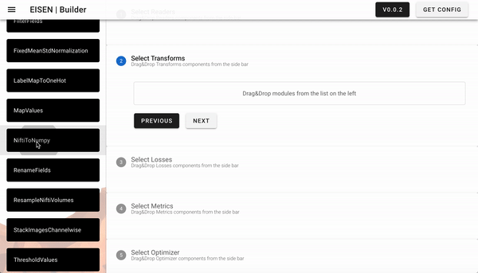
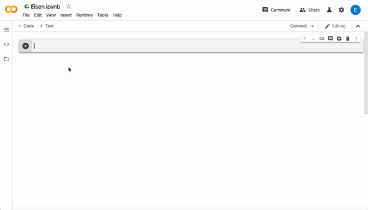

*********************
Features
*********************

.. contents:: Table of Contents

Eisen is built to give simple access to deep learning in medical image analysis. The main features are:

* Support for common datasets such as MSD, PatchCamelyon, etc.
* Pre-built transformations to manipulate data
* Training, Validation and Testing loops
* Automatic logging and summary export
* Visual experiment building through visual UI at http://builder.eisen.ai
* Compatibility with other libraries such as Torchvision and user code
* Different ways of accessing functionality, module import or CLI

Datasets
================================

Deep learning method are able to extract insights from data by learning model parameters that optimize a loss function.
Data is therefore central to any deep learning model.

Eisen includes functionality to handle different standard popular datasets that can be obtained from the internet,
it also includes the capability of supplying own datasets which can contain arbitrary data.

Right now, eisen supports the following public datasets:

+-------------------------------------------------------+---------------------------------------+-------------------------------------------------------+
| Title                                                 | URL                                   | Module (`eisen.datasets.` prefix)                     |
+=======================================================+=======================================+=======================================================+
| Medical segmentation decathlon                        | http://bit.ly/2w6YqX6                 | `MSDDataset`                                          |
+-------------------------------------------------------+---------------------------------------+-------------------------------------------------------+
| Patch Camelyon Datasets                               | http://bit.ly/3daNDfs                 | `PatchCamelyon`                                       |
+-------------------------------------------------------+---------------------------------------+-------------------------------------------------------+
| CAMUS Ultrasound Dataset                              | http://bit.ly/2Wdc8T6                 | `CAMUS`                                               |
+-------------------------------------------------------+---------------------------------------+-------------------------------------------------------+
| Intracranial Hemorrhage Detection Challenge (RSNA)    | http://bit.ly/3cXpN6G                 | `RSNAIntracranialHemorrhageDetection`                 |
+-------------------------------------------------------+---------------------------------------+-------------------------------------------------------+
| Personalized dataset as JSON file (see below)         | None                                  | `JsonDataset`                                         |
+-------------------------------------------------------+---------------------------------------+-------------------------------------------------------+

Personalized datasets can be created in JSON format.
The expected JSON file structure is a list of dictionaries. Each entry of the list contains one element of the dataset.
Each key of the dictionary stores different information about that data point.

Transforms
================================

Transforms operate on data dictionaries and implement functionality such as pre-processing and augmentation of data.
Transforms are operations that can be composed together by using `torchvision.transforms.Compose`. Once the transforms
are composed together they realize a transformation chain.

Each transform does one, and just one, basic operation.
Since arguments are not explicitly copied by transforms and are passed through the transformation chain by reference,
there is no dramatic overhead in brought in by the presence of multiple transforms each implementing a simple operation,
instead of a big one which implements the whole chain at once but is very complex, problem specific and prone to error.

Users are encouraged to implement their own transforms. These will be also accessible via Eisen configuration files and
CLI (see below) as soon as these user implementation are added to the `PYTHON_PATH`. User implementations need to
stick to the basic transform template, which is not formally defined in code but is explained in the documentation
at http://docs.eisen.ai/eisen/api.html#module-eisen.transforms .

You can find more information about the transforms here http://docs.eisen.ai/eisen/api.html#module-eisen.transforms

Workflows
================================

Workflows implement the core functionality of training, testing and validation. These modules are documented here
http://docs.eisen.ai/eisen/api.html#workflows and contain full and most importantly generic implementations that
can be used to train, test and validate models tackling virtually any task. 2D segmentation, 3D segmentation,
classification, regression can all be handled by Eisen workflows.

The content of data batches is automatically routed to the correct `torch.nn.Module` for processing. The result
of such processing can be automatically interpreted and logged in the tensorboard, the console, or logfile (see below).

Eisen workflows resolve the pain of haivng to write training, validation and testing loops from scratch each time. This
does not mean that users are barred from proposing their own workflows. For example, Eisen `0.0.3` does not support
training reinforcement learning agents due to the absence of a workflow that can cope with reinforcement learning
environments. Users can in this case implement their own workflow according to what stated in the documentation at
http://docs.eisen.ai/eisen/api.html#workflows and what can be learned from Eisen source code at
http://github.com/eisen-ai .

Logging
================================

The activity of a workflow can be logged by using `Hooks`. Hooks in Eisen listen for certain events to be generated
by a specific workflow. They respond to these events by performing actions on the data provided as a result of said
events.

For example, as the training workflow iterates the dataset to obtain batches of data to optimize the neural network,
the result of the optimization, its inputs, outputs, losses, metrics, a model snapshot and the current epoch number
are collected and recorded. Once an epoch finishes, a signal is generated. The collected information is therefore
sent to the hooks which listen to this specific workflow.

Each hook can perform its own functionality on the resulting data. For example `eisen.utils.logging.LoggingHook` logs
the progress of training in terms of losses and metrics on the console. `eisen.utils.logging.TensorboardSummaryHook`
exports inputs, outputs, losses and metrics to the tensorboard in a completely automated way.

Some hooks are also able to save artifacts based on whether the best metric or loss has been reached by the model.
These hooks such as `eisen.utils.artifacts.SaveTorchModelHook` or `eisen.utils.artifacts.SaveONNXModelHook` save
a snapshot or even the whole model history (the sequence of best models over time) in PyTorch and ONNX format
respectively.

Users can also define their own hooks by referring to the source and the documentation as implementation guidance.

Artifacts
================================

Artifacts can also be saved without using hooks (see above). It is possible to use eisen modules to serialize
models to disk. In Eisen `0.0.3` it is possible to save models to disk in PyTorch or ONNX format. This functionality
is realized by `eisen.utils.artifacts.SaveTorchModel` and `eisen.utils.artifacts.SaveONNXModel`.

These modules can be used when the user wants more control on how models are saved. They are also useful when
models are trained without using Eisen workflows. In that case, in fact, it will not be possible to use hooks during
training, validation or testing. I will therefore be impossible to use modules such as
`eisen.utils.artifacts.SaveTorchModelHook` or `eisen.utils.artifacts.SaveONNXModelHook`.

CLI
================================

Eisen can be accessed via a command line interface (CLI). Eisen-CLI can be installed by either using the meta package
via `pip install eisen` or explicitly via `pip install eisen_cli`.

Users can train, test and validate models via CLI. During training it is also possible to do validation and testing.
In order to use the CLI, it is necessary to provide a configuration file for Eisen in JSON format. This file contains
instructions about what to do during training, validation and testing. It contains a description of what modules should
be instantiated and what transformations and datasets should be used during each phase.

The simplest way to obtain this configuration file is to use http://builder.eisen.ai which provides a visual interface
to build complex configuration files leveraging Eisen modules and functionality. Once users are acquainted with
the way Eisen CLI works and how configuration files are structures, it will be easy for them to write configurations
from scratch.

The CLI documentation will appear soon on this website.

Compatibility
================================

Eisen is built to be compatible with user code, extensions, third party transforms, models and modules obtained from
other repositories or packages.

Almost everything can be used as it is. When users opt to use the full Eisen functionality and yet leverage mostly
third party code, it is possible to use wrappers.

This is best shown in the example at http://bit.ly/37oBdMZ where MNIST training and testing is done via Eisen on
a dataset imported from `torchvision` and using models and transformations obtained from third parties.

Documentation about how wrappers work in Eisen and what their purpose exactly is can be found here
http://docs.eisen.ai/eisen/api.html#wrappers .

Simplicity
================================

It is possible to use eisen as a library or via a command line interface. Usage with command line
interface requires experiment configuration which shall be supplied in form of a JSON file. Creating this JSON file
manually is often tedious and is suggested only in case the user has special needs (Eg. needs to include own python
modules into the experiments and make use of advanced functionality). The JSON configuration file can also be created
via a web-based user interface that can be reached at http://builder.eisen.ai

.. table:: Here you can see a visual comparison between the two ways of using Eisen.
   :align: center

   +---------+---------+
   | |logo1| | |logo2| |
   +---------+---------+

