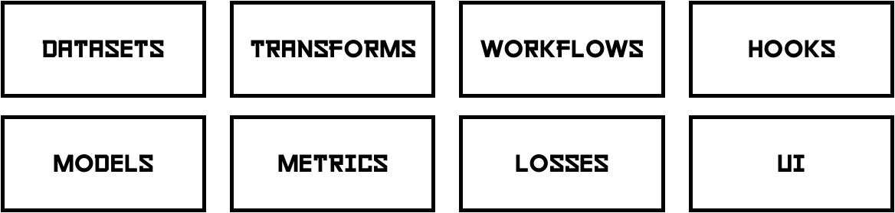
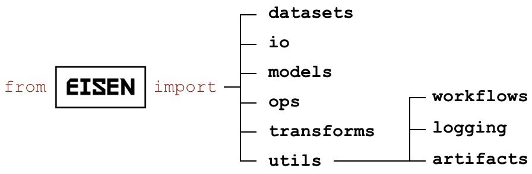
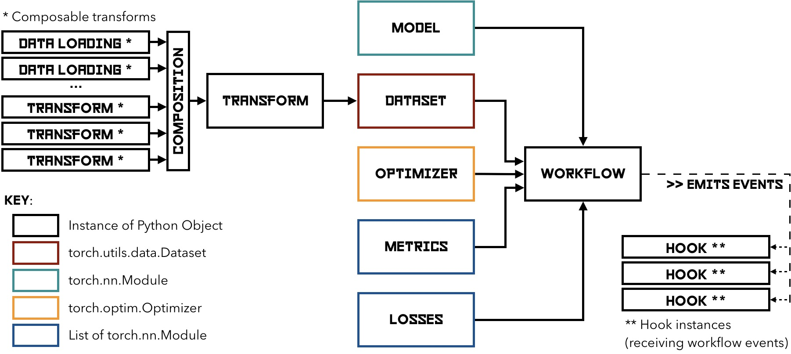

.. Eisen documentation master file, created by
   sphinx-quickstart on Wed Jan 29 20:11:11 2020.
   You can adapt this file completely to your liking, but it should at least
   contain the root `toctree` directive.

Eisen Documentation
=================================
Eisen is a software package to enable simple and quick development and experimentation with
deep learning models. It is designed for applications in healthcare.

Eisen provides a complete set of building blocks and everything in between:

|components|

Installing Eisen is extremely simple.

.. code-block:: bash

   pip3 install --upgrade eisen

Eisen implements an opinionated API that builds directly on PyTorch. The goal of Eisen is to be:

- Extremely simple to use

- Extremely easy to understand

- Similar to other packages in the PyTorch echosystem

- Easy to contribute to

We have subdivided Eisen in several sub-packages:

- Eisen meta-package (installs everything) `pip3 install eisen`

- Eisen core `pip3 install eisen-core`

- Eisen CLI `pip3 install eisen-cli`

- Eisen Deploy `pip3 install eisen-deploy`

- Eisen Extras `pip3 install eisen-extras`

You can also obtain Eisen as a Docker image which can be downloaded from dockerhub check out DockerHub at
https://hub.docker.com/repository/docker/eisenai/eisen

Eisen core modules are summarized in the figure below:

|modules|

Building with Eisen is simple. A typical project follows the architecture summarized in the figure below:

|workflow|

Links
==================

.. toctree::
   :caption: Home
   :maxdepth: 4

   index

.. toctree::
    :caption: Get Started
    :maxdepth: 4

    eisen/getstarted

.. toctree::
   :caption: Eisen-Core API
   :maxdepth: 4

   eisen/api

.. toctree::
   :caption: Eisen-Deploy API
   :maxdepth: 4

   eisen/deploy

.. toctree::
   :caption: Eisen-CLI
   :maxdepth: 4

   eisen/cli

.. toctree::
    :caption: Tutorials
    :maxdepth: 4

    eisen/tutorials

.. toctree::
    :maxdepth: 4
    :caption: Features

    eisen/features

Indices and tables
==================

* :ref:`genindex`
* :ref:`modindex`
* :ref:`search`

